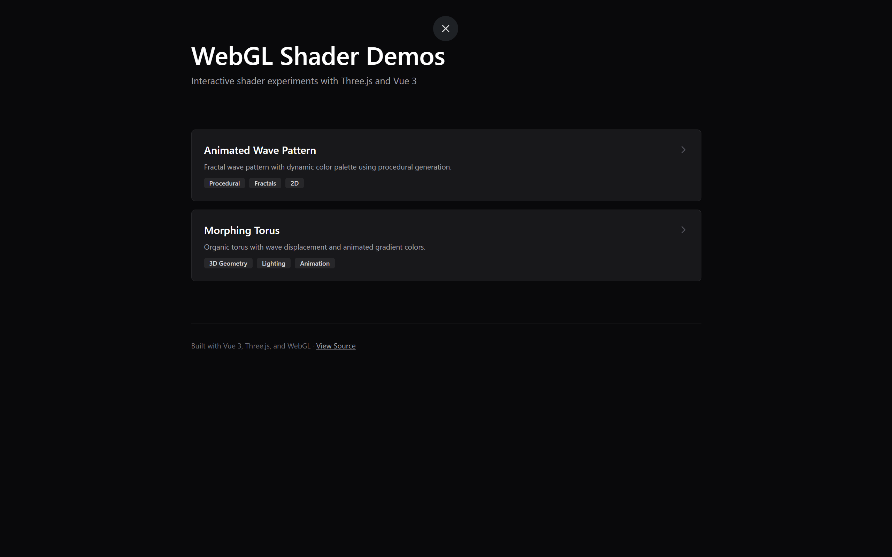

# WebGL Shader Gallery

An interactive collection of custom WebGL shaders demonstrating advanced graphics programming techniques. Built with Vue 3, Three.js, and GLSL for real-time 3D rendering in the browser.



## Live Demos

### Wave Pattern Shader
Procedural fractal generation with dynamic color palettes and animated wave displacement.


### Morphing Torus
3D geometry with vertex displacement and dual-point lighting system for realistic depth and highlights.


## Technologies

- **Vue 3** - Modern component-based framework with Composition API
- **Three.js** - WebGL rendering and 3D scene management
- **GLSL** - Custom vertex and fragment shaders
- **Vite** - Fast build tooling and hot module replacement
- **Tailwind CSS** - Utility-first styling

## Getting Started

```sh
# Install dependencies
npm install

# Run development server
npm run dev

# Build for production
npm run build
```

## Architecture

The project uses a component-based architecture with reusable shader components:
- Custom `ShaderCanvas` component for Three.js integration
- Modular GLSL shader files for easy experimentation
- Vue Router for seamless navigation between demos